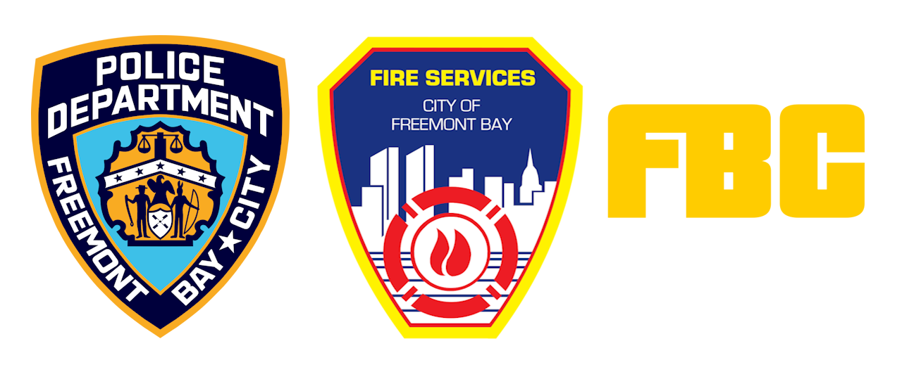

# Freemont Bay Project
This repository contains the assets for the Freemont Bay collection of Police, Fire, and Taxi vehicles.

	

## About the Mod
The Freemont Bay Project (skinpack for BeamNG), based on Johan The Channel's idea for a BeamNG lore-friendly NYC, is to include tens of police, fire, and taxi liveries unmistakably based on New York's IRL Counterparts. Each skin is to come with a configuration based on an IRL counterpart of the related vehicle, reflecting authentic NYPD, FDNY, and NYC Taxi vehicles.

### Factions

* __Freemont Bay Police Department__: The in-mod police force serving the fictious Freemont Bay.
* __Freemont Bay Fire Services__: The in-mod firefighting agency saving lives within Freemont Bay.
* __FBC Taxi & Limousine Commission__: The operating agency of the in-mod taxis.

## Contributing
Make sure you have a copy of BeamNG installed on your computer. Reference IRL photos of NYPD, FDNY, or NYC Taxi vehicles to make skins and configurations. Use [policecarwebsite.net](https://www.policecarwebsite.net/) or Google Images to find references.
Getting started with contributing is easy for BeamNG modders - see [here](CONTRIBUTING.md) for more information.

## Credits

* ValoDoment - Lead developer
* Johan The Channel - Original idea
* policecarwebsite.net - Reference photos
* Wikimedia Commons - Original FDNY and NYPD Emblems

This BeamNG mod will be available on the Repository for FREE and it's open source right here on GitHub!
